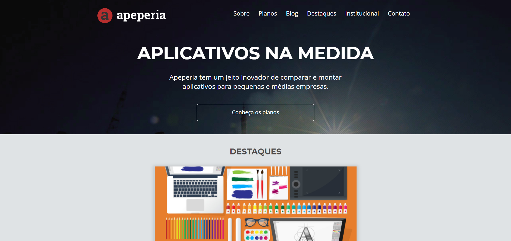

<h1 align="center">
  
</h1>

<h3 align="center">
  Layouts Responsivos: Trabalhando com layouts mobile
</h3>

Entenda o processo de desenvolvimento de páginas web e aprenda a lidar com adaptação de diferentes layouts

Por Matheus Alberto - Alura

  <a href="#como-executar-o-projeto">Como executar o projeto</a>&nbsp;&nbsp;&nbsp;|&nbsp;&nbsp;&nbsp;
  <a href="#conteúdo-do-curso">Conteúdo do curso</a>

Front-end

  

## Como executar o projeto

- Execute `git clone https://github.com/eliasmcastro/alura-layouts-responsivos.git` para clonar este repositório
- Abra o arquivo index.html no seu navegador de preferência para ver o resultado

## Conteúdo do curso

- Ferramentas, unidades e imagens
- Layout mobile e variáveis CSS
- Particularidades de telas
- Trabalhando a semântica HTML
- Evoluindo do mobile ao desktop
